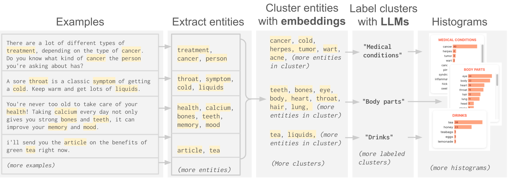
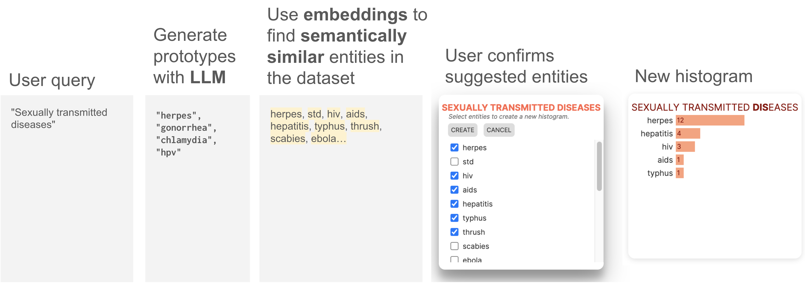

# Automatic histograms


AutoHistograms is an visualization tool for understanding text datasets. See [Automatic Histograms: Leveraging Language Models for Text Dataset Exploration
](https://arxiv.org/abs/2402.14880) for more details, or watch our demo video.

<iframe src="https://www.youtube.com/embed/EugsRaGUAYc" width="900" height="480" allow="autoplay; encrypted-media"></iframe>

## Motivation
Making sense of unstructured text datasets is a perennially difficult yet increasingly important task with the emergence of large language models. To do so, data practitioners often rely on dataset summaries, especially distributions of various derived features. 

Some supervised features, like toxicity or topics, are relevant to many datasets, and there are well-supported  (e.g., with [KYD](https://knowyourdata.withgoogle.com/)) tools for calculating these.

However, many interesting features are domain specific, e.g., genre or instrumentation for a music dataset, or diseases and symptoms for a medical dataset. Accordingly, data practitioners may run custom analyses for each dataset, which is cumbersome and difficult.

Alternatively, they can use unsupervised methods to understand datasets, but these can be hard to reproduce or interpret. We bridge this gap with AutoHistograms, a visualization tool leveraging LLMs. AutoHistograms automatically identifies relevant entity-based features, visualizes their distributions,and allows the user to interactively query the dataset for new categories of entities. 


## How does it work?
How can we do this automatically? Automatic histograms first finds entities in
the data, and then groups and labels them (e.g., to group "covid 19" and
"the flu" under the category "diseases"). Finally, they are displayed in the UI. 



Additionally, we can allow users to search with the fields, e.g., searching for
"musicians" to create a histogram that they care about in real time.




## Running instructions

Automatic Histograms has two parts. First the data is annotated: for this, we provide a library, or if you prefer, a binary which is a light wrapper around the library. 
Then, the output can be accessed by running a server (see below)
### 1. Annotating data
Your input data should be in csv form. The relevant flags are:

- `--directory` (directory of the input csv, and also where the output files will be written)
- `--input_csv` (name of the csv file)
- `--col_to_annotate` (column in the csv to annotate)


```
$ python3 -m venv auto_histo && . auto_histo/bin/activate && pip install -r automatic_histograms/requirements.txt
$ python -m automatic_histograms.run --palm_api_key_external=<your palm API key>
``` 
Note that running *both* the pipeline and the server require a PaLM API key. See these [instructions](https://makersuite.google.com/app/apikey) on how to get one.


This can also be run programmatically from python (see `run.py`):

```python
  from automatic_histograms import pipeline
  automatic_histograms = pipeline.AutomaticHistograms(
      input_csv=input_csv, 
      column_to_annotate=column,
      output_directory=output_directory,
      cache_directory=cache_directory,
  )
  automatic_histograms.run_pipeline()
```


### 2. Viewing the outputs

### Build the typescript/css/html
In a separate terminal window, build the typescript.
```
$ cd automatic_histograms/app
$ yarn && yarn build
```
### Run the python server
```
$ python3 -m venv auto_histo && . auto_histo/bin/activate && pip install -r automatic_histograms/requirements.txt
$ python -m automatic_histograms.app.server_external --palm_api_key_external=<your palm API key>
``` 
Note that running *both* the pipeline and the server require a PaLM API key. See these [instructions](https://makersuite.google.com/app/apikey) on how to get one.


Then navigate to 
`http://localhost:5000/?dir=<your_output_path>`

(If you do not supply a value for `<your_output_path>`, it will default to our demo pre-annotated dataset.)


